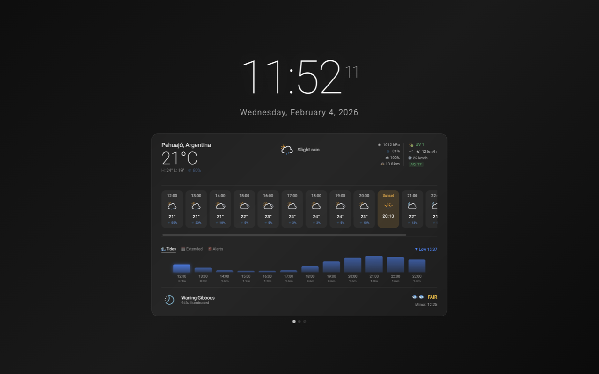

# 🌤️ Weather Clock

A beautiful Chrome extension that replaces your new tab with a feature-rich weather dashboard.



## Features

### 🕐 Beautiful Clock
- Elegant analog clock with smooth animations
- Weather icon displayed in the center
- Current date and location display

### 🌡️ Comprehensive Weather
- Current conditions with feels-like temperature
- Hourly forecast with timezone support
- 16-day extended forecast
- 15+ weather model options (GFS, ECMWF, etc.)
- Air Quality Index (AQI) display
- Wind speed and direction visualization

### 🌊 Tidal Information
- High/low tide times and heights
- Powered by Stormglass API
- 3D cube interface for tide display

### 🌙 Astronomical Data
- Moon phase with emoji display
- Sunrise/sunset times
- Solunar fishing periods (major/minor)

### 🏙️ Multi-City Support
- GPS location detection
- Save up to 4 additional cities
- Carousel navigation (swipe, arrows, dots)
- Per-city timezone display
- City search with autocomplete

### ⚠️ Disaster Alerts
- Global earthquake monitoring (USGS)
- Regional severe weather alerts:
  - 🇺🇸 USA (NWS)
  - 🇨🇦 Canada (NAAD)
  - 🇪🇺 Europe (MeteoAlarm - 38 countries)
  - 🇳🇿 New Zealand (GeoNet + MetService)
  - 🇦🇷 Argentina (SMN with polygon filtering)
  - 🇧🇷 Brazil (INMET)
  - 🇨🇱 Chile (MeteoChile)
  - 🌀 Tropical storms (NOAA NHC)
- Per-city alert toggles
- Chrome desktop notifications
- Badge showing active alert count

## Installation

### From Chrome Web Store
*(Coming soon)*

### Manual Installation (Developer Mode)
1. Download or clone this repository
2. Open Chrome and go to `chrome://extensions`
3. Enable "Developer mode" (toggle in top right)
4. Click "Load unpacked"
5. Select the extension folder

## Permissions

- **Geolocation**: To show weather for your current location
- **Storage**: To save your preferences and cities
- **Alarms**: For periodic alert checking
- **Notifications**: To alert you about disasters

## APIs Used

- [Open-Meteo](https://open-meteo.com/) - Weather data (free, no API key)
- [Stormglass](https://stormglass.io/) - Tidal data
- [Nominatim](https://nominatim.org/) - Geocoding
- [Meteocons](https://bas.dev/work/meteocons) - Weather icons
- Various government APIs for disaster alerts

## Development

```bash
# Clone the repo
git clone https://github.com/matutetandil/weather-clock.git

# Load in Chrome as unpacked extension
# Make changes to newtab.js, newtab.html, or background.js
# Reload extension to see changes
```

### Project Structure
```
├── manifest.json      # Extension configuration
├── newtab.html        # Main UI
├── newtab.js          # Frontend logic
├── background.js      # Alert service worker
└── icons/             # Extension icons
```

## Contributing

Contributions are welcome! Please feel free to submit a Pull Request.

## License

MIT License - feel free to use and modify.

## Credits

- Weather icons by [Bas Milius](https://bas.dev/work/meteocons)
- Weather data by [Open-Meteo](https://open-meteo.com/)
---

*Made with ☀️ and ☔ by Matías*
