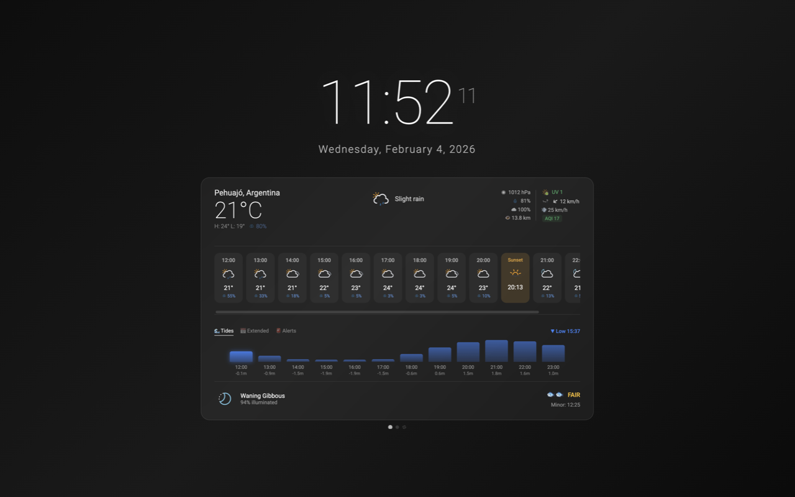

# 🌤️ Weather Clock

A beautiful Chrome extension that replaces your new tab with a feature-rich weather dashboard.



## Features

### 🕐 Beautiful Clock
- Elegant analog clock with smooth animations
- Weather icon displayed in the center
- Current date and location display

### 🌡️ Comprehensive Weather
- Current conditions with feels-like temperature
- Hourly forecast with timezone support
- 16-day extended forecast
- 15+ weather model options (GFS, ECMWF, etc.)
- Air Quality Index (AQI) display
- Wind speed and direction visualization

### 🌊 Tidal Information
- High/low tide times and heights
- Powered by Stormglass API
- 3D cube interface with configurable default tab (Tides, Extended Forecast, or Alerts)

### 🌙 Astronomical Data
- Moon phase with emoji display
- Sunrise/sunset times
- Solunar fishing periods (major/minor)

### 🏙️ Multi-City Support
- GPS location detection
- Save up to 4 additional cities
- Carousel navigation (swipe, arrows, dots)
- Per-city timezone display
- City search with autocomplete

### ⚠️ Disaster Alerts
- Global earthquake monitoring (USGS)
- Regional severe weather alerts:
  - 🇺🇸 USA (NWS)
  - 🇨🇦 Canada (NAAD)
  - 🇪🇺 Europe (MeteoAlarm - 35 countries, with region filtering)
  - 🇳🇿 New Zealand (GeoNet + MetService)
  - 🇦🇷 Argentina (SMN with polygon filtering)
  - 🇧🇷 Brazil (INMET)
  - 🇨🇱 Chile (MeteoChile with polygon filtering)
  - 🌀 Tropical storms (NOAA NHC)
- Only alerts in effect are shown. Every alert is filtered by its CAP validity
  window (`onset`..`expires`), so what you see matches the issuing authority's
  own map. Cancellations and test messages are discarded.
- Alerts starting within the next 24 hours appear dimmed and labelled
  "Upcoming — starts tomorrow 15:00", never as if they were already active.
- Per-city alert toggles
- Chrome desktop notifications
- Badge showing active alert count (alerts in effect only)

### 🇪🇺 About the European alerts

MeteoAlarm identifies the area a warning covers by EMMA region code and name
only — its feeds, its per-alert CAP documents and its JSON API all omit
geometry, and the EDR API that supports spatial queries is restricted to
MeteoAlarm members and re-distributors. Filtering at country level alone
would mean showing 182 warnings for Spain or 540 for Germany no matter where
the user actually is.

So the extension bundles the EMMA region polygons in `data/emma-regions.json`
(2003 regions, 35 countries, ~1.3 MB) and resolves the user's location
locally. A warning is kept only when it covers a region containing the user.
France renumbered its EMMA codes, so regions are matched by code *or* by
normalized name, which resolves 100% of the regions in every country feed
tested.

The dataset is derived from
[NiklasJordan/meteoalarm](https://github.com/NiklasJordan/meteoalarm) (MIT),
simplified with Douglas-Peucker at 0.005° and rounded to 3 decimals. Region
data © MeteoAlarm / EUMETNET, licensed
[CC BY 4.0](https://creativecommons.org/licenses/by/4.0/). Validated against
the full-resolution source over 1200 points: zero false positives, 1198/1200
exact agreement.

**Not covered:** Switzerland, Ukraine, the United Kingdom and Andorra publish
through MeteoAlarm but are absent from the region dataset, so no alerts are
shown there. This is logged rather than failing silently.

## Installation

### From Chrome Web Store
[Install Weather Clock](https://chromewebstore.google.com/detail/weather-clock/oljchkgkfkoennglohjhicakebnnjcca)

### Manual Installation (Developer Mode)
1. Download or clone this repository
2. Open Chrome and go to `chrome://extensions`
3. Enable "Developer mode" (toggle in top right)
4. Click "Load unpacked"
5. Select the extension folder

## Permissions

- **Geolocation**: To show weather for your current location
- **Storage**: To save your preferences and cities
- **Alarms**: For periodic alert checking
- **Notifications**: To alert you about disasters

## APIs Used

- [Open-Meteo](https://open-meteo.com/) - Weather data (free, no API key)
- [Stormglass](https://stormglass.io/) - Tidal data
- [Nominatim](https://nominatim.org/) - Geocoding
- [Meteocons](https://meteocons.com/) - Weather icons (via jsDelivr CDN)
- Various government APIs for disaster alerts

## Development

```bash
# Clone the repo
git clone https://github.com/matutetandil/weather-clock.git

# Load in Chrome as unpacked extension
# Make changes to newtab.js, newtab.html, or background.js
# Reload extension to see changes
```

### Project Structure
```
├── manifest.json      # Extension configuration
├── newtab.html        # Main UI
├── newtab.js          # Frontend logic
├── background.js      # Alert service worker
├── data/              # Bundled EMMA region polygons for European alerts
└── icons/             # Extension icons
```

## Contributing

Contributions are welcome! Please feel free to submit a Pull Request.

## License

MIT License - feel free to use and modify.

## Credits

- Weather icons by [Bas Milius](https://meteocons.com/)
- Weather data by [Open-Meteo](https://open-meteo.com/)
---

*Made with ☀️ and ☔ by Matías*
